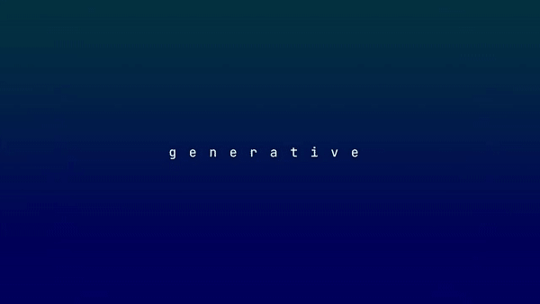

# Vesuna



Vesuna is a tiny utiliy library, to generate and use memorable random seeds.  

[Demo](https://pierrekeda.com/demo/vesuna/) ( WIP )  
Note that the result will always be the same for a given seed, despite being pseudorandomly generated.

# Credits

This library is based on David Bau's [seedrandom](https://github.com/davidbau/seedrandom).  
More specifically on [Alea](https://github.com/davidbau/seedrandom/blob/released/lib/alea.js), his port of [Johannes Baagøe's PRNG algorithm](https://github.com/nquinlan/better-random-numbers-for-javascript-mirror).

# What it's for

**Use a string as seed**  
Because it is easier to remember, share and differentiate than a numerical seed.  
Ex: bluefox/fireking vs 2030949/1879546.  

**Generate easy to remember strings**  
Use vesuna.autoseed() to generate an amusing short description, a codename, some gibberish, or a serial number.  

**Generate a wide variety of numbers**  
Use vesuna.random() to generate pseudorandom 32-bit floats between 0 and 1. You can generate as many as you need, and also can use some built-in helper methods to generate uints, booleans etc.  

**Reproduce specific results**   
Once setup with a seed, vesuna.random() will produce floats in sequences that will always be the same with that exact seed. It is intended as a Math.random() replacement for generative applications using many randomized settings, allowing to easily save and restore an exact outcome.  

	DISCLAIMER: 
	Made for personal/creative use.  
	The seeded pseudorandomness is predictable by nature.  
	It is unsafe for security-sensitive applications.  

# Installation

Via [npm](https://www.npmjs.com/package/vesuna).   

	npm install vesuna --save

```javascript
import { Vesuna } from 'vesuna';

const vesuna = new Vesuna();
```

Or manually import [the minified build](build/vesuna.min.js).

```html
<script src="vesuna.min.js"></script>
```

```javascript
const vesuna = new VESUNA.Vesuna();
```

# Basic usage

```javascript

// Manually set a seed (case sensitive)
vesuna.seed = 'custom seed';

// Generate a random float between 0 and 1, similar to Math.random()

vesuna.random(); // Will always return 0.7621682670433074
vesuna.random(); // Will always return 0.44742328324355185
vesuna.random(); // Will always return 0.6701190846506506

vesuna.reset();  // Reset the sequence

vesuna.random(); // Will always return 0.7621682670433074
vesuna.random(); // Will always return 0.44742328324355185
vesuna.random(); // Will always return 0.6701190846506506

vesuna.seed = 'new seed'; // Change the seed for another sequence

vesuna.random(); // Will always return 0.12564408965408802
vesuna.random(); // Will always return 0.3661188334226608
vesuna.random(); // Will always return 0.6075689995195717
```

# Autoseed

You can seed a Vesuna instanceswith any string, but it also includes a string generator, designed to create easy to memorize seeds.  

Note: Vesuna instances autoseed by default.  

```javascript
let vesuna = new Vesuna( 'foobar' );
console.log( vesuna.seed ); // foobar

vesuna.autoseed();
console.log( vesuna.seed ); // Ex: bluefox

vesuna = new Vesuna();
console.log( vesuna.seed ); // Ex: fireking
```

## Settings

There are a few settings to customize the random seeds you can get.

```javascript
// Set vesuna.verbose to true for more complex seeds
vesuna.verbose = true;
vesuna.autoseed(); // blue-fox-428

// Different modes for different possible outcomes
vesuna.mode = Vesuna.modes.CODENAME;
vesuna.autoseed(); // blue-fox, blue-fox-428

vesuna.mode = Vesuna.modes.DESCRIPTION;
vesuna.autoseed(); // sneezing-penguin, loudly-sneezing-giant-penguin

vesuna.mode = Vesuna.modes.GIBBERISH;
vesuna.autoseed(); // xuve, xuvetemi

vesuna.mode = Vesuna.modes.SERIAL;
vesuna.autoseed(); // 58AS, 58AS39KG

// Separate words using a symbol
vesuna.separator = Vesuna.separators.NONE;       // bluefox
vesuna.separator = Vesuna.separators.DASH;       // blue-fox
vesuna.separator = Vesuna.separators.DOT;        // blue.fox
vesuna.separator = Vesuna.separators.SLASH;      // blue/fox
vesuna.separator = Vesuna.separators.SPACE;      // blue fox
vesuna.separator = Vesuna.separators.TILDE;      // blue~fox
vesuna.separator = Vesuna.separators.UNDERSCORE; // blue_fox
// Can be any string
vesuna.separator = '+'; // blue+fox

// Default settings
vesuna.separator = Vesuna.separators.NONE;
vesuna.mode = Vesuna.modes.CODENAME;
vesuna.verbose = false;
```

## Possible outcomes

This autoseeder provides a limited number of possible seeds, depending on the current settings. For example, using the defaults (Vesuna.modes.CODENAME & vesuna.verbose=false) gives 1024 possible outcomes.  

**Codename**  
1024 / 1,024,000  

**Description**  
256 / 65,536  

**Gibberish**  
11,025 / 121,550,625  

**Serial**  
Depending on letter-number RNG  
From 6,561 / 43,046,721  
To 279,841 / 78,310,985,281  

## Use without autoseeding

To leave the current seed unchanged, and just get a random string for another use:  

```javascript
vesuna.codename();
vesuna.description();
vesuna.gibberish();
vesuna.serial();
```
Those will use the current autoseed settings ( separator & verbose ), but unlike vesuna.autoseed() these methods will NOT update vesuna.seed.  

# Random helpers

In addition to vesuna.random(), you can use the following, for convenience:

```javascript
vesuna.amount();		// Alias for vesuna.random()
vesuna.noise()			// Float between -1 and 1
vesuna.number( -2, 2 ); // Float between -2 and 2
vesuna.number( -2, 2, true ); // -2, -1, 0, 1, 2 ( rounded )
vesuna.int( -3, 3 )     // -3, -2, -1, 0, 1, 2, 3
vesuna.uint( 4 );       // 0, 1, 2, 3, 4
vesuna.boolean();       // true or false
vesuna.chance( 1 / 4 ); // 1/4 chance to be true, 3/4 to be false
vesuna.item( array );   // Item from an array
vesuna.char( string );  // Character from a string
```

# Summary

## Seed generation
```javascript

// Create an instance, autoseeded
const vesuna = new Vesuna();
console.log( vesuna.seed ); // bluefox

// Create an instance, manual seed
const vesuna2 = new Vesuna( 'foobar' );
console.log( vesuna.seed ); // foobar

// Generate a seed
vesuna.autoseed();
console.log( vesuna.seed ); // fireking

// Or set a seed manually
vesuna.seed = 'custom seed';

// Modes
vesuna.mode = Vesuna.modes.CODENAME;    // blue-fox
vesuna.mode = Vesuna.modes.DESCRIPTION; // sneezing-penguin
vesuna.mode = Vesuna.modes.GIBBERISH;   // xuve
vesuna.mode = Vesuna.modes.SERIAL;      // 58AS

// Separators
vesuna.separator = Vesuna.separators.NONE;       // bluefox
vesuna.separator = Vesuna.separators.DASH;       // blue-fox
vesuna.separator = Vesuna.separators.DOT;        // blue.fox
vesuna.separator = Vesuna.separators.SLASH;      // blue/fox
vesuna.separator = Vesuna.separators.SPACE;      // blue fox
vesuna.separator = Vesuna.separators.TILDE;      // blue~fox
vesuna.separator = Vesuna.separators.UNDERSCORE; // blue_fox
// Can be any string
vesuna.separator = '+'; // blue+fox

// For more complexity
vesuna.verbose = true;

// Defaults
vesuna.mode = Vesuna.modes.CODENAME; 
vesuna.separator = Vesuna.separators.NONE;
vesuna.verbose = false;
```

## Seed usage

```javascript
// Once the seed is set, use it to generate pseudorandom numbers sequences
vesuna.random(); // Will always return 0.7621682670433074
vesuna.random(); // Will always return 0.44742328324355185
vesuna.random(); // Will always return 0.6701190846506506

vesuna.reset();  // Reset the sequence

vesuna.random(); // Will always return 0.7621682670433074
vesuna.random(); // Will always return 0.44742328324355185
vesuna.random(); // Will always return 0.6701190846506506

vesuna.seed = 'new seed'; // Change the seed for another sequence

vesuna.random(); // Will always return 0.12564408965408802
vesuna.random(); // Will always return 0.3661188334226608
vesuna.random(); // Will always return 0.6075689995195717

// Helper methods
vesuna.amount();        // Alias for vesuna.random()
vesuna.noise();         // Alias for vesuna.number( -1, 1 )
vesuna.number( -2, 2 ); // Float between -2 and 2
vesuna.int( -3, 3 );    // Alias for vesuna.number( -3, 3, true )
vesuna.uint( 4 );       // Alias for vesuna.number( 0, 4, true )
vesuna.boolean();       // true or false
vesuna.chance( 1 / 4 ); // 1/4 chance to be true, 3/4 to be false
vesuna.item( array );   // Item from an array
vesuna.char( string );  // Character from a string
```

***
*Pierre Keda - 2021*
